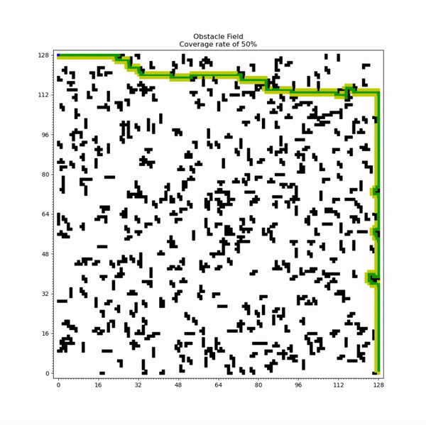
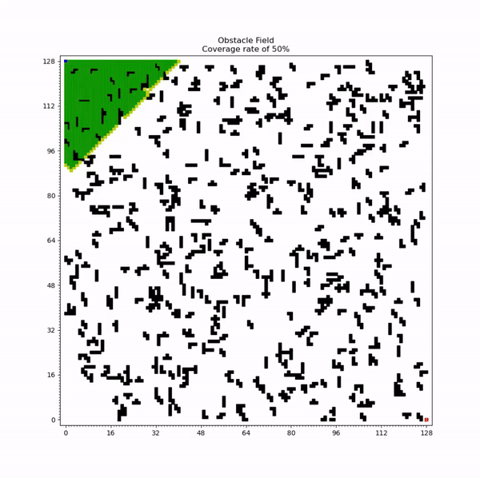
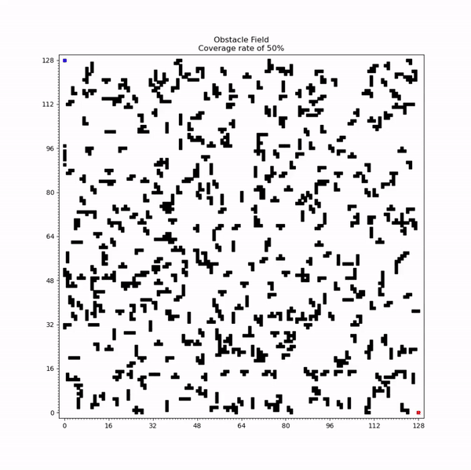

# Grid Search Algorithms
This repo contains code to implement various grid search algorithms.

Below are a few GIFs of depth first search, breadth first search, and Dijkstra's algorithm in action. 

## Depth First Search



## Breadth First Search



## Dijkstra's algorithm



## Running the Code

To run the code, follow the commands below: 

```
git clone https://github.com/azzamshaikh/grid_search_algorithms.git 
cd grid_search_algorithms
python RunGridSearchAlgorithms.py
```
If an IDE is preferred, such as PyCharm, open the RunGridSearchAlgorithms.py and run the file. 

There are two approaches that the user can run the code. If it is desired to run each planner once, this will occur by default. 

A custom density can also be added in the RunGridSearchAlgorithms.py file. 

The density can be input as shown below. The number should be from 0 to 100. The units for the number is %.

`run_one_density(50)`

In the case above, 50 refers to the filling 50% of the obstacle field. 

If it is desired to run multiple densities, the code in the RunGridSearchAlgorithms.py needs to be modified. Please refer to the instructions provided in the code. 

It should be noted that, while the random planner can be run, due to the length required to find a solution, a max iteration limit has been set. Thus, it will always fail in finding a goal.