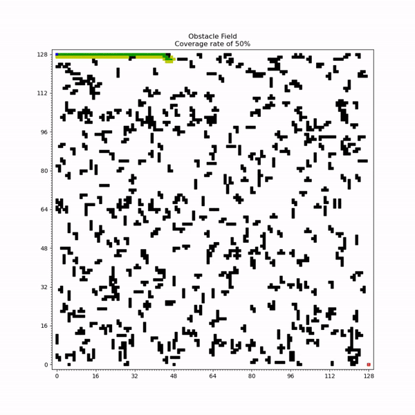

# Grid Search Algorithms
This repo contains code to implement various grid search algorithms.

Below are a few GIFs of breadth first search, depth first search, and Dijkstra's algorithm in action. 

## Breadth First Search

## Depth First Search

## Dijkstra's algorithm

## Running Code

To run the code, download this repository and run the RunGridSearchAlgorithms.py file.